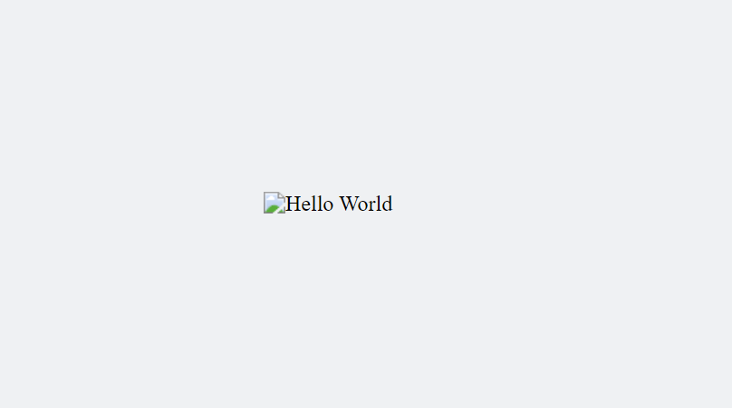
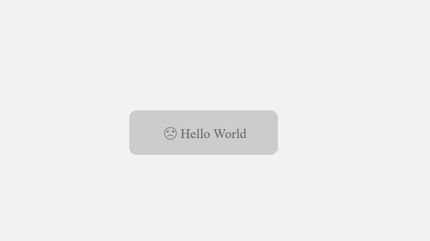

# Alt Image Styling

A small CSS demo showing how to style the fallback `alt` text that browsers show when an image (`helloWorld.jpg`, not included in this repo) fails to load. Pure CSS `::before`/`::after` pseudo-elements turn the broken image into a styled placeholder card with an icon and the alt text.

#### Before Style


#### After Style


## Tech stack

Plain HTML + CSS, no build tooling or dependencies.

## Running it

```bash
git clone https://github.com/er-shrey/alt-image-style.git
cd alt-image-style
open index.html   # or just double-click index.html in a file browser
```

`index.html` references an image `./helloWorld.jpg` that isn't part of the repo - add any JPG with that name next to `index.html` (or edit the `src`) so the broken-image styling in `style.css` has something to fall back on.

## License

MIT - see [LICENSE](LICENSE).
